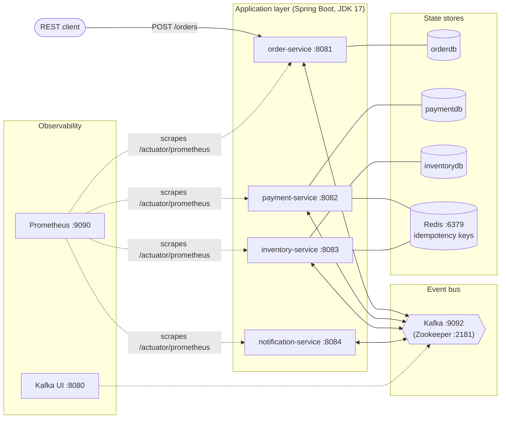
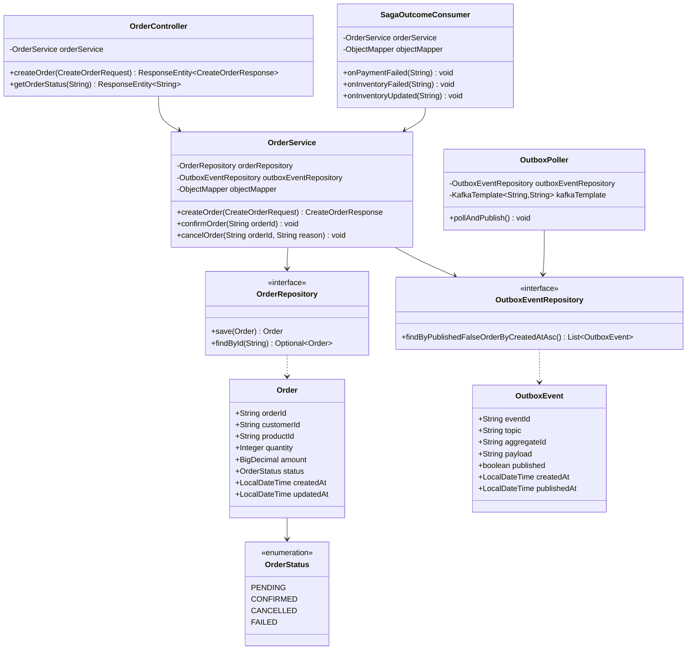
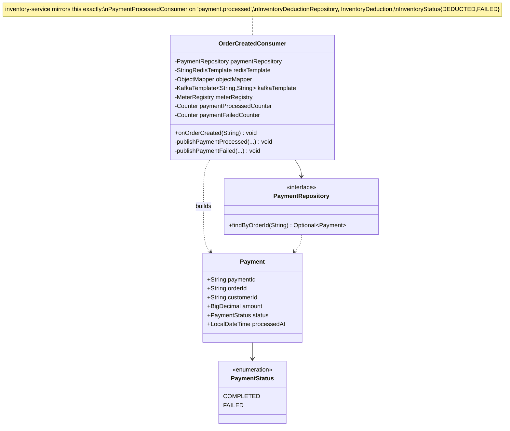
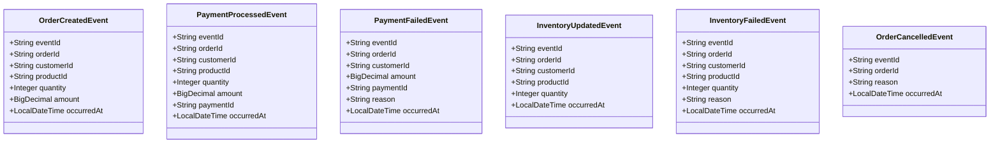
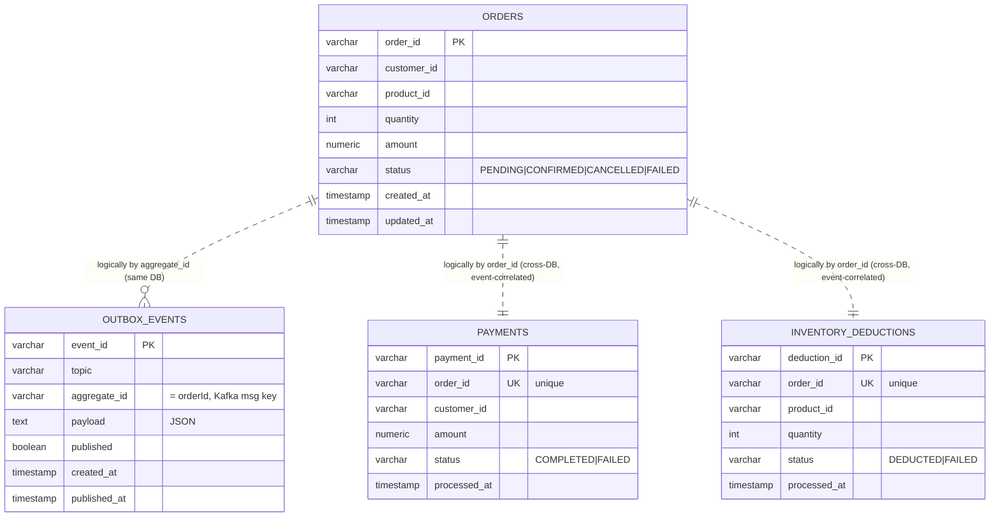
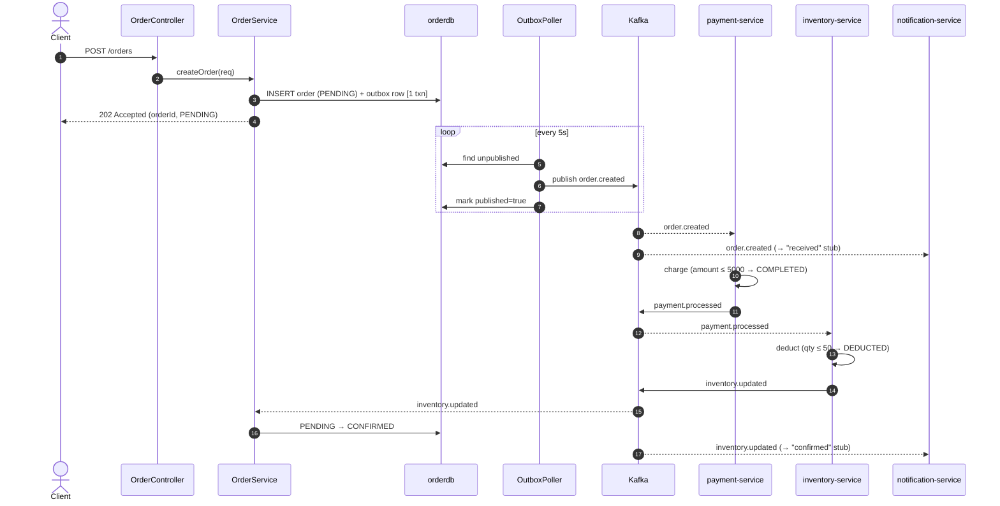
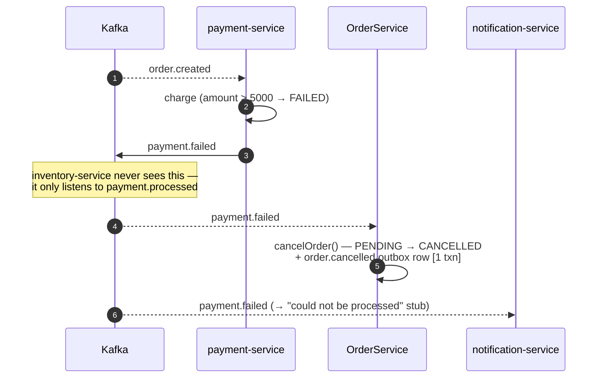
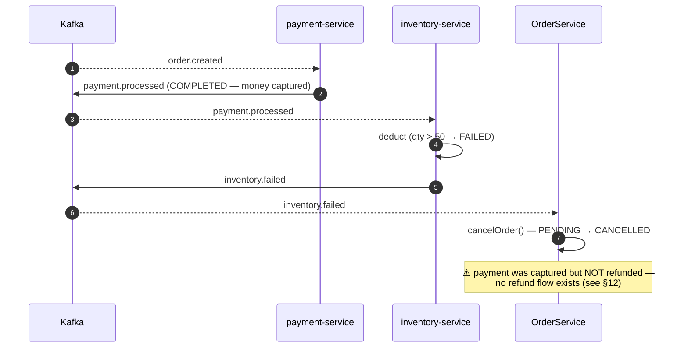
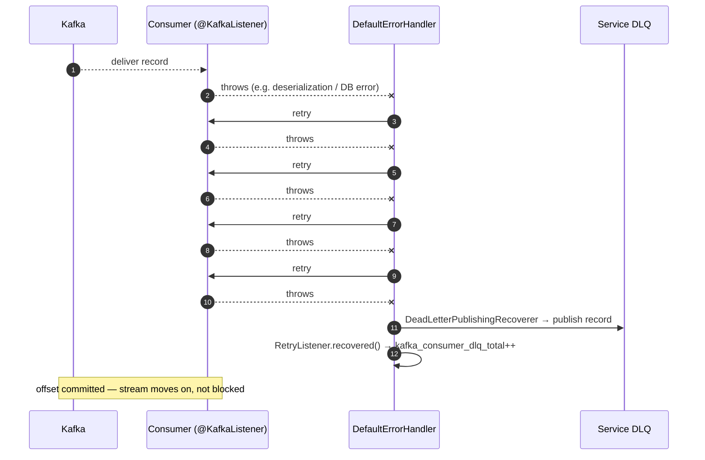
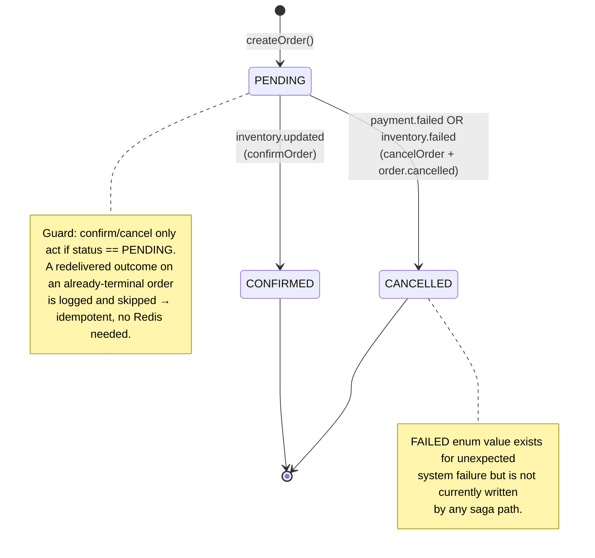

# Kafka Event Platform — Design Document

A complete design reference for the order-fulfillment saga platform: high-level architecture, low-level per-component design, class and ER diagrams, sequence flows, and the reliability/consistency guarantees each piece provides.

This document is the "how and why it's built" companion to:
- [`README.md`](README.md) — what it is + how to run it
- [`SAGA_DESIGN.md`](SAGA_DESIGN.md) — focused deep-dive on the saga/compensation semantics

---

## Table of contents

1. [Problem & goals](#1-problem--goals)
2. [High-Level Design (HLD)](#2-high-level-design-hld)
3. [Event contracts & topic topology](#3-event-contracts--topic-topology)
4. [Low-Level Design (LLD)](#4-low-level-design-lld)
5. [Class diagrams](#5-class-diagrams)
6. [Data model / ER diagrams](#6-data-model--er-diagrams)
7. [Sequence diagrams](#7-sequence-diagrams)
8. [Order state machine](#8-order-state-machine)
9. [Cross-cutting concerns](#9-cross-cutting-concerns)
10. [Reliability & consistency guarantees](#10-reliability--consistency-guarantees)
11. [Technology choices & rationale](#11-technology-choices--rationale)
12. [Known limitations & future work](#12-known-limitations--future-work)

---

## 1. Problem & goals

Fulfilling an order touches several independent concerns — charging the customer, reserving stock, notifying them — that must happen in a defined order, must not lose events, must not double-charge or double-deduct on retries, and must roll the order back cleanly if a step fails partway through.

**Design goals:**

| Goal | How it's met |
|---|---|
| No lost events, even if Kafka is briefly down | Transactional **outbox pattern** in order-service |
| No double side effects on redelivery | **Redis idempotency** keyed on `orderId` |
| Partial failure leaves no half-completed order | **Saga** with compensation → order ends `CONFIRMED` or `CANCELLED`, never stuck |
| Poison/failed messages don't block the stream | **Per-service DLQ** + exponential-backoff retry |
| A single order is traceable across all services | **MDC correlation ID** (`orderId`) on every log line |
| One-command local bring-up | **docker-compose** with all 10 containers + healthchecks |

**Non-goals (explicit):** real payment-gateway / stock integration (both stubbed deterministically), authn/authz, horizontal-scale tuning, exactly-once Kafka transactions (we use at-least-once + idempotent consumers instead).

---

## 2. High-Level Design (HLD)

### 2.1 System context

Four independent Spring Boot microservices communicate **only** through Kafka events — no synchronous service-to-service calls. Each owns its own Postgres database (shared-nothing); Redis is shared for idempotency keys; Prometheus scrapes all four.



### 2.2 Architectural style & key patterns

- **Event-driven choreography** (not orchestration): no central coordinator; each service reacts to the previous step's event and emits its own. Trade-off: simpler to build and loosely coupled, but the end-to-end flow isn't visible in one place — mitigated by the diagrams here.
- **Saga pattern** for the distributed transaction across payment → inventory, with order-service performing compensation on failure.
- **Transactional outbox** for reliable event publishing from order-service.
- **Database-per-service**: `orderdb`, `paymentdb`, `inventorydb`. notification-service is stateless.
- **CQRS-lite**: write path is the saga; read path (`GET /orders/{id}`) is a placeholder.

### 2.3 The core flow (happy path)

```
POST /orders → order.created → payment.processed → inventory.updated → Order CONFIRMED
```

Inventory is deliberately triggered by `payment.processed`, **not** `order.created` — payment must succeed before stock is committed. (The pre-saga version fanned both out from `order.created` in parallel, which could deduct stock for an order whose payment later failed.)

### 2.4 The two failure paths (compensation)

```
payment.failed  → order-service → Order CANCELLED (+ order.cancelled)   [inventory never ran]
inventory.failed → order-service → Order CANCELLED (+ order.cancelled)   [payment already succeeded]
```

Deterministic stub failure triggers keep compensation tests reproducible:
- payment-service declines when `amount > 5000`
- inventory-service declines when `quantity > 50`

### 2.5 Component responsibilities

| Service | Consumes | Produces | Owns | Responsibility |
|---|---|---|---|---|
| **order-service** | `payment.failed`, `inventory.updated`, `inventory.failed` | `order.created`, `order.cancelled` | `orderdb` (orders, outbox_events) | Accept orders (REST), publish via outbox, drive `Order.status` from saga outcomes, compensate |
| **payment-service** | `order.created` | `payment.processed`, `payment.failed` | `paymentdb` (payments) | Stub-charge, emit outcome |
| **inventory-service** | `payment.processed` | `inventory.updated`, `inventory.failed` | `inventorydb` (inventory_deductions) | Stub-deduct stock, emit outcome |
| **notification-service** | `order.created`, `payment.failed`, `inventory.updated`, `inventory.failed` | *(only DLQ)* | *(none)* | Fire-and-forget stub email/SMS |

---

## 3. Event contracts & topic topology

All topics: **3 partitions** (keyed by `orderId` → per-order ordering), **replication factor 1** (single-broker dev). Payloads are **raw JSON strings** on the wire (see [§9.4](#94-serialization-the-raw-json-string-decision)).

### 3.1 Business topics

| Topic | Producer | Consumers | Payload fields |
|---|---|---|---|
| `order.created` | order-service | payment-service, notification-service | eventId, orderId, customerId, productId, quantity, amount, occurredAt |
| `payment.processed` | payment-service | inventory-service | eventId, orderId, customerId, productId, quantity, amount, paymentId, occurredAt |
| `payment.failed` | payment-service | order-service, notification-service | eventId, orderId, customerId, amount, paymentId, reason, occurredAt |
| `inventory.updated` | inventory-service | order-service, notification-service | eventId, orderId, customerId, productId, quantity, occurredAt |
| `inventory.failed` | inventory-service | order-service, notification-service | eventId, orderId, customerId, productId, quantity, reason, occurredAt |
| `order.cancelled` | order-service | *(none yet — audit/extension point)* | eventId, orderId, reason, occurredAt |

> **Note:** `payment.processed` is intentionally *not* consumed by order-service. Order-service only learns the outcome once inventory has also run — it waits for `inventory.updated`/`inventory.failed`. This keeps `Order.status` a true reflection of the *whole* saga completing, not just payment.

### 3.2 Dead-letter topics

| DLQ topic | Owner | Retry policy |
|---|---|---|
| `order.created.dlq.payment-service` | payment-service | Exponential: 1s, 2s, 4s, 8s (4 retries) |
| `payment.processed.dlq.inventory-service` | inventory-service | Exponential: 1s, 2s, 4s, 8s (4 retries) |
| `order-service.dlq` | order-service | Exponential: 1s, 2s, 4s, 8s (4 retries) |
| `notification-service.dlq` | notification-service | Fixed: 1s × 2 retries (non-critical) |

DLQs are **per-service, not per-topic** (`<topic>.DLT` default is avoided): each consuming service fails independently, and a shared DLQ would blur which consumer actually failed a given record.

---

## 4. Low-Level Design (LLD)

Every service follows the same layered structure. Below, order-service is shown in full (the most complex); the others are variations on it.

### 4.1 order-service (the saga initiator + coordinator of its own state)

```
controller/  OrderController        REST: POST /orders, GET /orders/{id}
service/     OrderService           createOrder / confirmOrder / cancelOrder (all @Transactional)
consumer/    SagaOutcomeConsumer    @KafkaListener × 3 (payment.failed, inventory.updated, inventory.failed)
outbox/      OutboxPoller           @Scheduled(fixedDelay=5000) publish loop
entity/      Order, OrderStatus, OutboxEvent
repository/  OrderRepository, OutboxEventRepository
config/      KafkaTopicConfig, KafkaErrorHandlingConfig, JacksonConfig
```

**Write path — `OrderService.createOrder()`** (single DB transaction):
1. Build `Order` (status `PENDING`), save to `orders`.
2. Build `OrderCreatedEvent`, serialize to JSON.
3. Save an `OutboxEvent` row (`published=false`, topic=`order.created`) in the **same transaction**.
4. Return `202 Accepted` immediately — Kafka publish happens asynchronously.

Because steps 1 and 3 commit atomically, an order is never persisted without its outbound event, and vice versa — even if the process crashes right after commit.

**Publish path — `OutboxPoller.pollAndPublish()`** (every 5s, `@Transactional`):
1. `findByPublishedFalseOrderByCreatedAtAsc()` — oldest unpublished first.
2. For each: `kafkaTemplate.send(topic, aggregateId, payload).get()` — synchronous, blocks for broker ack.
3. On ack: set `published=true`, `publishedAt=now`, save.
4. On failure: log, leave `published=false` → retried next cycle (at-least-once).

**Saga-outcome path — `SagaOutcomeConsumer`** → delegates to `OrderService`:
- `payment.failed` → `cancelOrder(orderId, reason)`
- `inventory.failed` → `cancelOrder(orderId, reason)`
- `inventory.updated` → `confirmOrder(orderId)`

`confirmOrder`/`cancelOrder` are **guarded state transitions**: they only act if `status == PENDING`, otherwise they log-and-skip. This makes them idempotent with no Redis needed — a redelivered outcome can't overwrite a terminal state. `cancelOrder` additionally writes an `order.cancelled` outbox row in the same transaction as the status flip (reusing the outbox guarantee).

### 4.2 payment-service

```
consumer/  OrderCreatedConsumer   @KafkaListener("order.created")
entity/    Payment, PaymentStatus
repository/ PaymentRepository (+ findByOrderId)
config/    KafkaTopicConfig, KafkaErrorHandlingConfig, JacksonConfig
```

**`OrderCreatedConsumer.onOrderCreated()`** flow:
1. `MDC.put("orderId", …)` (correlation) — `try/finally` removes it.
2. **Idempotency check**: `redisTemplate.hasKey("payment:processed-order:{orderId}")` → if present, skip.
3. **Find-or-create** payment: `paymentRepository.findByOrderId(orderId)` else build new. This handles the retry case where a prior attempt saved the row but failed to publish — `orderId` is `unique`, so a blind re-insert would loop forever on the constraint violation.
4. Decision: `amount > 5000` → status `FAILED` else `COMPLETED`.
5. Publish `payment.processed` **or** `payment.failed` (`.get()`, synchronous).
6. **Only now** set the Redis idempotency key (TTL 24h) — *after* a successful publish, so a mid-flight failure still retries cleanly rather than being falsely marked "done".
7. Increment Micrometer counter (`payment.processed` / `payment.failed`).

### 4.3 inventory-service

Structurally identical to payment-service, with the saga-critical difference that its listener is on **`payment.processed`**, not `order.created`.

```
consumer/  PaymentProcessedConsumer   @KafkaListener("payment.processed")
entity/    InventoryDeduction, InventoryStatus
repository/ InventoryDeductionRepository (+ findByOrderId)
```

Decision rule: `quantity > 50` → `FAILED` (+ `inventory.failed`) else `DEDUCTED` (+ `inventory.updated`). Same Redis idempotency + find-or-create recovery + publish-then-mark ordering as payment-service.

### 4.4 notification-service

Stateless. Two consumers, both fire-and-forget (no DB, no idempotency — a duplicate notification is a minor annoyance, not a correctness bug):

```
consumer/  OrderCreatedConsumer   @KafkaListener("order.created")  → "order received"
           SagaOutcomeConsumer    @KafkaListener × 3               → confirmed / failed messages
```

### 4.5 Error-handling config (shared shape across all four)

`KafkaErrorHandlingConfig` builds a `DefaultErrorHandler` from:
- a `DeadLetterPublishingRecoverer` → the service's own DLQ topic,
- a backoff (`ExponentialBackOffWithMaxRetries(4)` for the 3 critical services; `FixedBackOff(1s, 2)` for notification),
- a `RetryListener` that increments `kafka.consumer.retry` (per retry) and `kafka.consumer.dlq` (on final recovery), tagged by service.

---

## 5. Class diagrams

### 5.1 order-service



### 5.2 payment-service & inventory-service (same shape)



### 5.3 Event DTO family

All events share `eventId`, `orderId`, `occurredAt`. There is **no shared library** — each service keeps its own copy of every DTO it produces/consumes (deliberate: services stay independently deployable; the cost is manual contract sync).



---

## 6. Data model / ER diagrams

Three isolated databases. There are **no cross-database foreign keys** — `orderId` is the logical join key, correlated only through events, never enforced at the DB level (shared-nothing).



| DB | Tables | Notes |
|---|---|---|
| `orderdb` | `orders`, `outbox_events` | outbox lives with the order for transactional write |
| `paymentdb` | `payments` | `order_id` UNIQUE → one payment per order, DB-enforced |
| `inventorydb` | `inventory_deductions` | `order_id` UNIQUE → one deduction per order, DB-enforced |

The `UNIQUE(order_id)` constraints are the **second line of idempotency defense** behind Redis — even if the Redis check is bypassed, the DB refuses a duplicate row.

---

## 7. Sequence diagrams

### 7.1 Happy path



### 7.2 Payment-failure compensation



### 7.3 Inventory-failure compensation (payment already captured)



### 7.4 Retry → DLQ on poison message



---

## 8. Order state machine

`Order.status` is the single source of truth for where an order is. Only order-service mutates it, and only via guarded `PENDING`-origin transitions — terminal states are never overwritten.



---

## 9. Cross-cutting concerns

### 9.1 Idempotency (two layers)

1. **Redis** (`payment:processed-order:{orderId}`, `inventory:processed-order:{orderId}`, TTL 24h) — checked at listener entry, keyed on **`orderId`** not `eventId`. This catches both Kafka redelivery *and* a distinct duplicate event for an order already processed. The key is set **after** a successful publish, so a mid-processing failure genuinely retries instead of being falsely skipped.
2. **DB `UNIQUE(order_id)`** on `payments` / `inventory_deductions` — a hard backstop if Redis is unavailable or bypassed.

order-service needs neither for its status transitions — the `PENDING`-guard makes them naturally idempotent.

### 9.2 Reliable publishing — transactional outbox

Only order-service uses a full outbox (order + event in one txn, async poller). payment/inventory-service publish directly after their DB write and rely on the **find-or-create recovery** pattern for the narrow save-succeeded-but-publish-failed window — a smaller, accepted gap since their DB row can be safely reconstructed on redelivery.

### 9.3 Correlation-ID logging (MDC)

`MDC.put("orderId", …)` is set at the entry of every listener / REST handler / poller iteration and cleared in `finally` (so it never leaks across pooled threads). The log pattern `orderId=%X{orderId:-}` surfaces it on **every** line — including framework logs (Hibernate SQL, Kafka producer init) — enabling `grep orderId=<uuid>` across all four services to reconstruct one order's entire journey.

### 9.4 Serialization — the raw-JSON-string decision

Producers use `StringSerializer` and consumers `StringDeserializer`; each service serializes/deserializes DTOs manually with a configured `ObjectMapper`. Spring's `JsonSerializer`/`JsonDeserializer` were dropped because they emit a `__TypeId__` header binding the payload to a specific producer-side class name — brittle across services with independent DTO copies. Manual string handling keeps the wire format a clean, portable JSON document. (This also fixed an early double-encoding bug where a JSON string was being JSON-serialized *again*.)

### 9.5 Observability

| Metric | Type | Source |
|---|---|---|
| `payment_processed_total` / `payment_failed_total` | Counter | payment consumer |
| `inventory_updated_total` / `inventory_failed_total` | Counter | inventory consumer |
| `kafka_consumer_retry_total{service}` | Counter | `RetryListener.failedDelivery` |
| `kafka_consumer_dlq_total{service}` | Counter | `RetryListener.recovered` |
| consumer lag, JVM, HTTP | Gauge/Counter | spring-kafka + Micrometer (automatic) |

Exposed at `/actuator/prometheus`, scraped every 15s. No Grafana — endpoint verification was the chosen alternative.

---

## 10. Reliability & consistency guarantees

| Property | Guarantee | Mechanism |
|---|---|---|
| Event durability | An accepted order's event is **never lost** | Outbox row committed with the order; poller retries until acked |
| Delivery semantics | **At-least-once** | Poller re-publishes unacked; consumers may see duplicates |
| Duplicate side effects | **Prevented** | Redis idempotency + DB `UNIQUE(order_id)` + guarded state transitions |
| Ordering | Per-order, in-order | `orderId` as Kafka key → same partition |
| Partial-failure consistency | Order always reaches a **terminal state** | Saga compensation → `CONFIRMED` or `CANCELLED`, never stuck `PENDING` |
| Poison-message isolation | Stream **not blocked** | Retry with backoff, then DLQ + offset commit |
| Cross-service atomicity | **Not** provided (by design) | No 2PC; eventual consistency via saga. The inventory-failure refund gap (§12) is the visible cost |

---

## 11. Technology choices & rationale

| Choice | Why | Trade-off / note |
|---|---|---|
| Kafka | Durable log, replayable, partitioned ordering, consumer groups | Heavier than a simple queue |
| Choreography saga | No coordinator to build/operate; matches existing fan-out | Flow not centrally visible |
| Postgres per service | Shared-nothing isolation; per-service `UNIQUE` idempotency | 3 DBs to run (one container, multiple logical DBs in dev) |
| Redis idempotency | Fast O(1) dedup keyed on orderId; TTL auto-cleanup | Extra infra dependency |
| Outbox (order-service) | Atomic persist + publish without XA/2PC | Publish latency = poll interval (≤5s) |
| Spring Kafka `DefaultErrorHandler` | Built-in retry + DLQ recovery + retry listeners | — |
| Raw JSON strings | Portable wire format across independent DTO copies | Manual (de)serialization in each listener |
| **JDK 17 required** | Lombok 1.18.x silently mis-processes annotations on JDK 25 (generated methods vanish, no compile error) | Must pin `JAVA_HOME` to `openjdk@17` for local builds |
| Micrometer + Prometheus | Standard Spring Boot metrics pipeline | Grafana left out of scope |

---

## 12. Known limitations & future work

- **No payment refund on inventory failure.** Inventory-failure compensation cancels the order but the already-captured payment is not refunded. `order.cancelled` is published as the natural hook — a future refund consumer in payment-service would react to it. Currently the saga's most significant correctness gap, flagged rather than hidden.
- **No outbox in payment/inventory-service.** A crash in the narrow window between their DB write and Kafka publish is recoverable on redelivery (find-or-create) but not zero-risk like order-service's flow.
- **`GET /orders/{id}` is a placeholder** — returns a hardcoded string, not the real status from `OrderRepository`.
- **`OrderStatus.FAILED`** is defined but never written by any saga path (reserved for unexpected system failure).
- **Stubbed business logic** — payment charging and stock checks are deterministic threshold stubs (`amount > 5000`, `quantity > 50`), not real integrations.
- **Single-broker Kafka, replication factor 1** — fine for local dev, not production-durable.
- **No authn/authz, rate limiting, or schema registry** — out of scope for this project's goals.
