# Kafka Event Platform

An order-fulfillment saga built on Kafka: place an order, and a chain of independent services — payment, inventory, notification — react to it in sequence, with automatic compensation if payment or inventory fails partway through.

Built to exercise the failure-handling side of event-driven systems, not just the happy path: outbox pattern for reliable publishing, Redis-based idempotency, per-service dead-letter queues with exponential backoff retry, and saga compensation when a downstream step declines.

## Architecture

Four Spring Boot services, one Kafka topic per event type, one Postgres database per service (except notification-service, which is stateless), Redis for idempotency, Prometheus for metrics.

```mermaid
flowchart TD
    Client(["POST /orders"]) --> OrderSvc

    subgraph OrderFlow["order-service (8081)"]
        OrderSvc["OrderController → OrderService\n(order + outbox row, one txn)"]
        Poller["OutboxPoller\n(polls every 5s)"]
        SagaConsumer["SagaOutcomeConsumer\n(status transitions)"]
        OrderSvc -.->|writes unpublished row| Poller
    end

    OrderCreated[("order.created")]
    Poller -->|publish| OrderCreated

    OrderCreated --> PaymentSvc
    OrderCreated --> NotifySvc1

    subgraph PaymentFlow["payment-service (8082)"]
        PaymentSvc["OrderCreatedConsumer\nstub charge, declines above $5000"]
    end

    PaymentProcessed[("payment.processed")]
    PaymentFailed[("payment.failed")]
    PaymentSvc -->|success| PaymentProcessed
    PaymentSvc -->|declined| PaymentFailed

    PaymentProcessed --> InventorySvc
    PaymentProcessed --> NotifySvc2
    PaymentFailed --> SagaConsumer
    PaymentFailed --> NotifySvc3

    subgraph InventoryFlow["inventory-service (8083)"]
        InventorySvc["PaymentProcessedConsumer\nstub deduction, declines above qty 50"]
    end

    InventoryUpdated[("inventory.updated")]
    InventoryFailed[("inventory.failed")]
    InventorySvc -->|success| InventoryUpdated
    InventorySvc -->|declined| InventoryFailed

    InventoryUpdated --> SagaConsumer
    InventoryUpdated --> NotifySvc4
    InventoryFailed --> SagaConsumer
    InventoryFailed --> NotifySvc5

    SagaConsumer -->|PENDING → CONFIRMED| Confirmed(["Order confirmed"])
    SagaConsumer -->|PENDING → CANCELLED| OrderCancelled[("order.cancelled\n(compensation, no consumers yet)")]

    subgraph NotifyFlow["notification-service (8084) — stub email/SMS"]
        NotifySvc1["order received"]
        NotifySvc2["order.created listener"]
        NotifySvc3["payment failed"]
        NotifySvc4["order confirmed"]
        NotifySvc5["inventory failed"]
    end

    PaymentSvc -.->|"4-5 retries, exponential backoff"| PayDLQ[["order.created.dlq.payment-service"]]
    InventorySvc -.->|"4-5 retries"| InvDLQ[["payment.processed.dlq.inventory-service"]]
    SagaConsumer -.->|"4-5 retries"| OrderDLQ[["order-service.dlq"]]
    NotifySvc1 -.->|"2-3 retries, fixed backoff"| NotifyDLQ[["notification-service.dlq"]]

    style PayDLQ fill:#4a1a1a,stroke:#c44
    style InvDLQ fill:#4a1a1a,stroke:#c44
    style OrderDLQ fill:#4a1a1a,stroke:#c44
    style NotifyDLQ fill:#4a1a1a,stroke:#c44
```



Two things worth noticing in that diagram:

1. **Inventory is triggered by `payment.processed`, not `order.created`.** Payment must succeed before stock is committed — the old design ran payment and inventory in parallel off the same event, which could deduct stock for an order whose payment later failed.
2. **`order.cancelled` has no consumers yet.** It's the compensation event order-service emits on either failure path, published for audit/traceability and as the extension point for a future payment-refund flow (see [`SAGA_DESIGN.md`](SAGA_DESIGN.md) for why inventory-failure compensation currently stops short of an actual refund).

Full saga design, event contracts, and the reasoning behind each decision: [`SAGA_DESIGN.md`](SAGA_DESIGN.md).

## Services

| Service | Port | Database | Role |
|---|---|---|---|
| order-service | 8081 | `orderdb` | Accepts orders via REST, writes order + outbox row transactionally, polls and publishes, consumes saga outcomes to drive `Order.status` |
| payment-service | 8082 | `paymentdb` | Consumes `order.created`, stub-charges, publishes `payment.processed`/`payment.failed` |
| inventory-service | 8083 | `inventorydb` | Consumes `payment.processed`, stub-deducts stock, publishes `inventory.updated`/`inventory.failed` |
| notification-service | 8084 | *(none)* | Fire-and-forget stub email/SMS on `order.created` and all three saga terminal events |

Infra: Kafka + Zookeeper (9092), Kafka UI (8080), Postgres (5432), Redis (6379), Prometheus (9090).

## How to run

Requires Docker Desktop running. Two ways to run it, pick one:

### One command (everything, including the 4 services)

```bash
docker compose up -d --build
```

Builds all four service images (each does its own Maven build inside the container — no local JDK/Maven needed) and brings up all 10 containers: Kafka, Zookeeper, Postgres, Redis, Prometheus, Kafka UI, and the four services. First run takes a few minutes to build; `docker compose ps` should show all containers `healthy` within ~30-60s of starting. Verified: a clean `docker compose down` followed by `docker compose up -d --build` comes back up healthy and with Postgres data intact (named volume), every time.

### Dev mode (infra in Docker, services on your host — faster edit/rebuild loop)

Requires **JDK 17** specifically on your host — see [Design decisions](#design-decisions) for why.

```bash
# 1. Start infrastructure only
docker compose up -d zookeeper kafka kafka-ui postgres redis prometheus

# 2. Start each service (separate terminals), pinned to JDK 17
export JAVA_HOME=$(/usr/libexec/java_home -v 17)
(cd order-service && mvn spring-boot:run)
(cd payment-service && mvn spring-boot:run)
(cd inventory-service && mvn spring-boot:run)
(cd notification-service && mvn spring-boot:run)
```

Both modes use the same `application.yml` per service — `DB_HOST`/`KAFKA_BOOTSTRAP_SERVERS`/`REDIS_HOST` default to `localhost` (dev mode) and get overridden to container service names by `docker-compose.yml` (one-command mode).

### Place an order (either mode)

```bash
curl -X POST http://localhost:8081/orders \
  -H "Content-Type: application/json" \
  -d '{"customerId":"cust-1","productId":"prod-1","quantity":2,"amount":150.00}'
```

Watch it land: `docker exec -it postgres psql -U postgres -d orderdb -c "SELECT order_id, status FROM orders;"` — should show `CONFIRMED` within a couple seconds. Or browse Kafka UI at `localhost:8080` to watch the events flow through each topic.

To see the saga's failure paths, place an order with `amount` over `5000` (payment declines) or `quantity` over `50` (inventory declines, after payment succeeds) — either way `orders.status` ends up `CANCELLED`.

## Design decisions

- **Outbox pattern, order-service only.** The order row and its outbound event are written in one DB transaction, then a scheduled poller (`OutboxPoller`, every 5s) publishes and marks it sent — so a Kafka outage never loses an order, it just delays the event. Verified by killing the Kafka container mid-flight; the order still returns `202`, and the event publishes on the next poll once Kafka is back. Payment/inventory-service publish directly after their DB write instead (no outbox) — a smaller, accepted gap given their event's target topic is inherently a downstream, less critical write than the order record itself; see the recovery-path comments in their consumers for how a partial `save-succeeded-but-publish-failed` retry is still handled safely.
- **Saga via choreography, not orchestration.** No coordinator service — each service reacts to the previous step's event and publishes its own. Simpler to build and matches the fan-out style already used for `order.created`, at the cost of the overall flow not being visible in any single place (mitigated by the diagram above and `SAGA_DESIGN.md`).
- **Idempotency via Redis, keyed on `orderId`** (not `eventId`) in payment/inventory-service. `eventId`-based dedup only catches redelivery of the identical Kafka message; `orderId`-based catches that plus a second, distinct event that references an order already processed. The dedup key is set only *after* the downstream publish succeeds, not before — otherwise a retry after a publish failure would see its own key and skip itself, never actually retrying.
- **Per-service DLQs**, not Spring's shared default `<topic>.DLT`. Each consuming service fails independently; a shared DLQ per topic would mix failures from every consumer of that topic together and lose which one actually failed.
- **Correlation-ID logging via MDC**, keyed on `orderId`, set at the entry point of every Kafka listener and REST handler and cleared in `finally`. Every log line touched while processing an order carries it automatically — including framework logging (e.g. lazy Kafka producer init, Hibernate) — not just the lines that explicitly interpolate `orderId` into the message.
- **JDK 17 is required for local builds**, not JDK 25 (Homebrew's current default `openjdk` formula) — Lombok's annotation processing silently produces incomplete bytecode on JDK 25 with this Lombok version, causing every `@Data`/`@Builder`-generated method to disappear with no compiler error until something downstream fails to find it. `openjdk@17` side by side via Homebrew, `JAVA_HOME` pointed at it, is the fix.

## Observability

All four services expose `/actuator/prometheus`, scraped by the bundled Prometheus (`localhost:9090`). Beyond the default JVM/Kafka-client metrics (including consumer lag, exposed automatically by spring-kafka's Micrometer binder):

- `payment_processed_total` / `payment_failed_total` — payment outcomes
- `inventory_updated_total` / `inventory_failed_total` — inventory outcomes
- `kafka_consumer_retry_total{service=...}` — retry attempts per service
- `kafka_consumer_dlq_total{service=...}` — records recovered to a DLQ per service

No Grafana dashboard — verifying the metrics endpoint directly was the chosen alternative rather than adding a UI layer with open-ended scope.

## Known gaps

- Inventory-failure compensation cancels the order but doesn't refund the already-captured payment — no refund flow/topic exists yet (see `SAGA_DESIGN.md`).
- Payment/inventory-service don't have their own outbox tables, so there's a narrow window between their DB write and Kafka publish where a crash could lose the publish (recoverable on redelivery via the find-or-create pattern in each consumer, but not zero-risk the way order-service's flow is).
